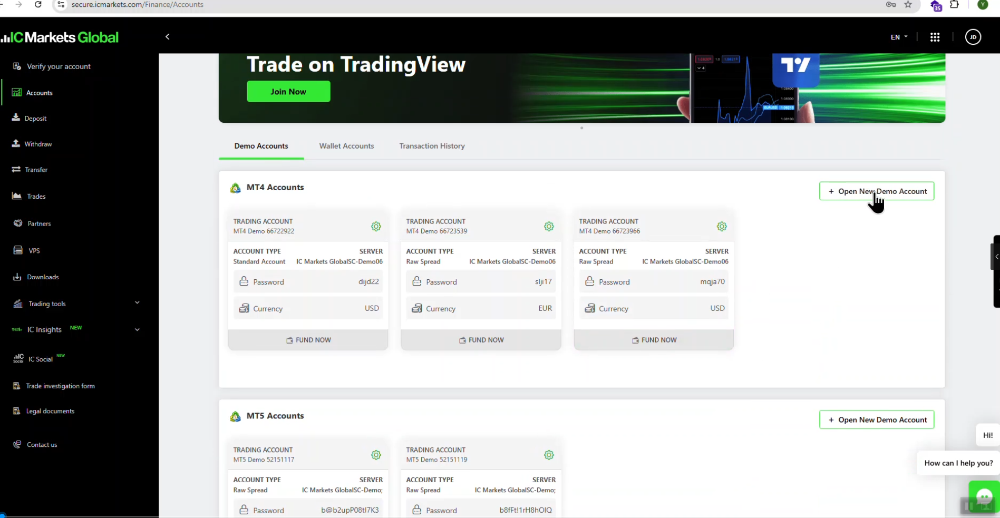
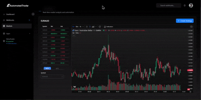
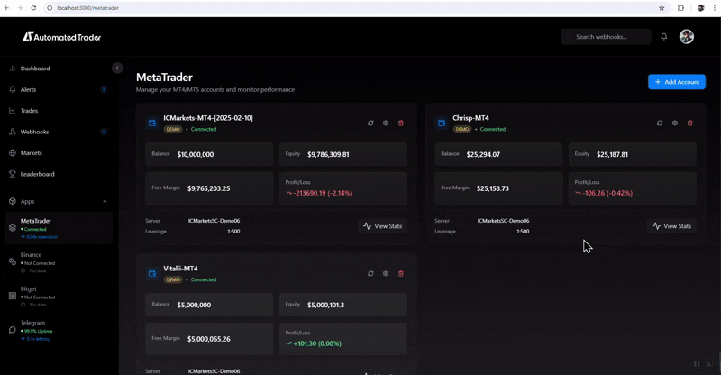
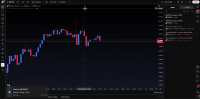
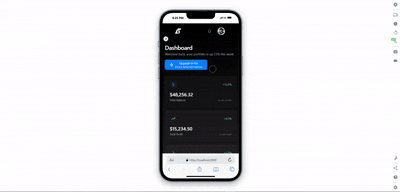

# 📈 AI Forex Trading Platform

An **AI-powered automated trading system** that integrates with popular brokers and trading APIs to execute real-time strategies, visualize performance, and reduce manual errors.

---

## 🚀 Features
- 🤖 **Automated Trading** – Connects with MetaTrader, TradeLocker, and ActTrader APIs  
- 📡 **Signal Integration** – Real-time signal processing from TradingView via WebSockets  
- 🧠 **AI-Powered Analytics** – Predictive models for strategy optimization and risk management  
- 📊 **Equity & P&L Dashboards** – Monitor performance, balances, and risk exposure  
- 🔄 **Lifecycle Management** – Automates trade execution, logging, and reporting  

---

## 🛠️ Tech Stack
- **Backend:** Python, FastAPI  
- **APIs:** MetaTrader, TradeLocker, ActTrader, TradingView  
- **Data:** WebSockets, PostgreSQL/Supabase  
- **Frontend (Dashboard):** React / Next.js (optional)  
- **Infrastructure:** Docker, GCP/AWS

## 📊 Demo / Screenshots
LandingPage View:

Metatrader Account Registration Page:

| 📊 Forex Trading Market Analysis (Real-Time) |
|----------------------------------------------|
|    |

| 📈 Trades Analysis and Data Visualization (Win, Loss, Equity, Margin, Trades, etc.) |
|-------------------------------------------------------------------------------------|
|                                                  |

| 📡 Integration with TradingView (Real-Time) |
|---------------------------------------------|
|       |

| 📱 Mobile Version |
|-------------------|
|  |

